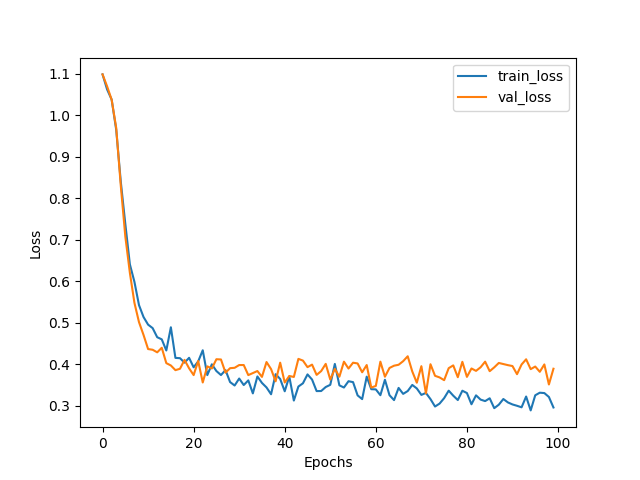
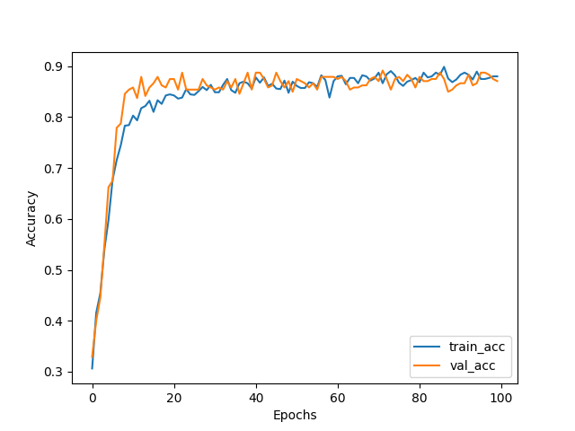

## 📌 Overview  
This project implements an Artificial Neural Network (ANN) from scratch using only NumPy. It covers the forward pass, backward pass, and training process without relying on deep learning frameworks like TensorFlow or PyTorch.  


## 📚 Suggested Prerequisites
- Knowledge of linear algebra (matrix multiplication, dot product)  
- Understanding of Softmax regression and gradient descent with other optimizers
- Familiarity with NumPy for numerical computations  

## ✅ Key Topics Covered  
- Fully connected neural network implementation  
- Forward and backward propagation  
- Activation functions (ReLU, Softmax, etc.)  
- Gradient descent and other optimizers like ADAM, ADAGRAD, RMSPROP, and Momentum  
- Regularization techniques like dropout  
- Loss and accuracy visualization


## 📂 Project Structure  
```
ANN_from_Scratch/  
│-- Notebooks/  
│   ├── ANN_from_scratch.ipynb  
│-- Images/  
│   ├── loss_plot.png  
│   ├── accuracy.png
│-- README.md
```


You can run the notebook step by step to understand how ANN works.


## 📊 Results & Visualization

### 🔹 Accuracy
The final accuracy of the ANN model with regularization drop out:

** Test Accuracy: 85 %**

### 🔹 Loss Reduction
The model's loss decreases over time, indicating successful learning.



### 🔹 Accuracy plot
Validation accuracy is near to training accuracy, i.e model variance is low.




Acknowledgments

Inspired by "Neural Networks from Scratch" by Harrison Kinsley and Daniel Kukieła.
And Vizuara.ai
 